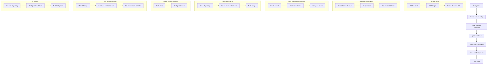
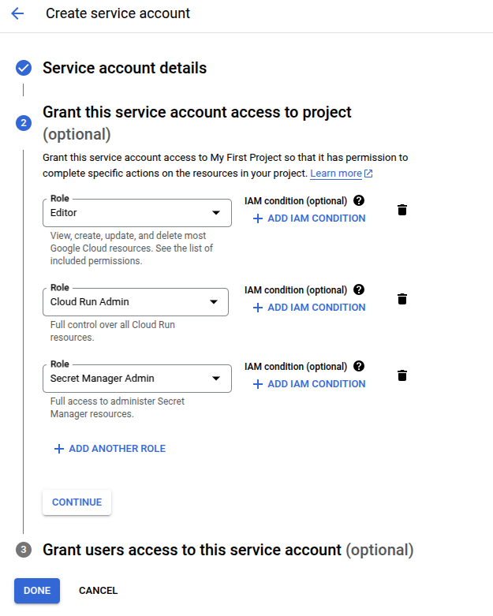
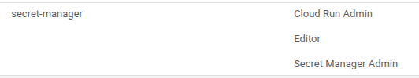
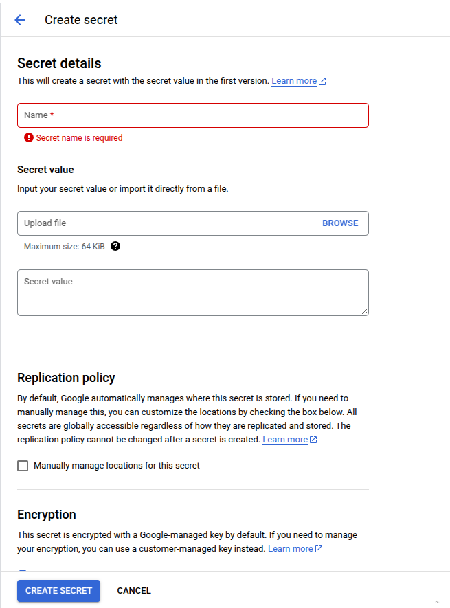
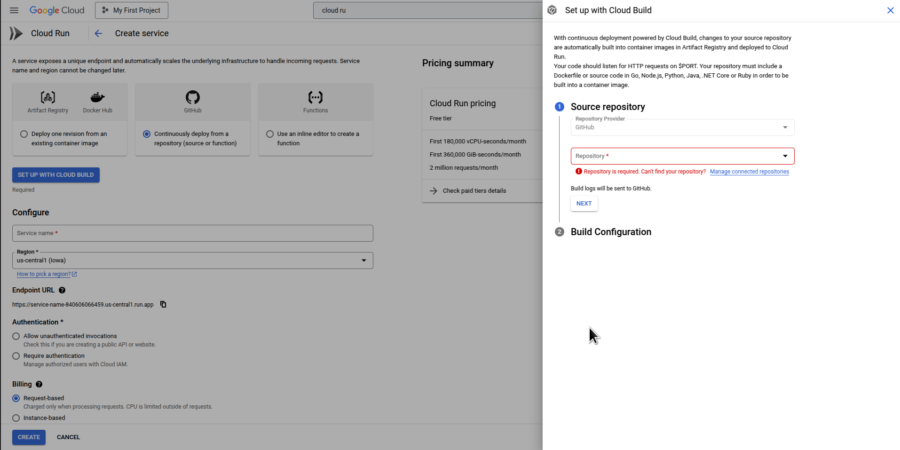

# FastAPI Application with Google Cloud Secret Manager

This repository demonstrates how to build and deploy a FastAPI application to Google Cloud Run with secure secret management using Google Cloud Secret Manager. The application includes CI/CD setup using GitHub and Cloud Build.

## Architecture Overview



## Prerequisites

1. Google Cloud Platform Account
   - Create a new project or use an existing one in the [Google Cloud Console](https://console.cloud.google.com)
   - Note your Project ID (example: `example-project-id`)

2. Enable Required APIs
   - Navigate to "APIs & Services > Library" in the Google Cloud Console
   - Search for and enable the following APIs:
     - Cloud Build API
     - Cloud Run API
     - Secret Manager API

## Service Account Setup

1. Create a Service Account

   

   - Navigate to "IAM & Admin > Service Accounts" in the Google Cloud Console
   - Click "CREATE SERVICE ACCOUNT"
   - Fill in the service account details:
     - Name: `secret-manager` (or your preferred name)
     - Description: "Service account for Secret Manager access"
   - Click "CREATE AND CONTINUE"

2. Assign Required Roles

   
   
   As shown in the image above, assign the following roles:
   - Editor: For general GCP resource management
   - Cloud Run Admin: For deploying and managing Cloud Run services
   - Secret Manager Admin: For accessing and managing secrets
   - Click "DONE" to save the roles

3. Create and Download Service Account Key
   - In the service accounts list, click on your newly created service account
   - Go to the "KEYS" tab
   - Click "ADD KEY" > "Create new key"
   - Select "JSON" format
   - Click "CREATE" to download the key file
   - Save the key as `example-sa.json` (or your preferred name)

## Secret Manager Configuration

1. Create a Secret

   

   - Navigate to "Security > Secret Manager" in the Google Cloud Console
   - Click "CREATE SECRET"
   - Enter a name for your secret (e.g., `example-sa`)
   - Click "CREATE SECRET"

2. Add a Secret Version
   - In the secret details page, click "ADD VERSION"
   - Enter your secret value in the text area
   - Click "ADD" to create the new version

3. Configure Access
   - In the secret details page, go to the "PERMISSIONS" tab
   - Click "GRANT ACCESS"
   - Add your service account email
   - Assign the "Secret Manager Secret Accessor" role
   - Click "SAVE"

## Application Setup

1. Environment Variables
   Create a `.env` file with the following:
   ```
   GOOGLE_APPLICATION_CREDENTIALS=norse-fiber.json
   RESOURCE_NAME=projects/840606066459/secrets/example-sa
   PROJECT_ID=norse-fiber-410815
   ```

2. Local Development Setup
   - Install Python dependencies: `pip install -r requirements.txt`
   - Run the application: `uvicorn main:app --reload`
   - Visit http://localhost:8000/docs for Swagger UI

## GitHub Repository Setup

1. Push Code to GitHub
   - Create a new repository on GitHub
   - Push your code to the repository

2. Configure GitHub Secrets
   - Navigate to your repository's Settings > Secrets and variables > Actions
   - Add the following secrets:
     - `GCP_PROJECT_ID`: Your project ID
     - `GCP_SA_KEY`: Content of your service account JSON key

## Cloud Run Deployment

1. Create a New Service

   
   
   - Navigate to "Cloud Run" in the Google Cloud Console
   - Click "CREATE SERVICE"
   - Choose "Continuously deploy from source repository"
   - Click "SET UP WITH CLOUD BUILD"

2. Configure Source Repository
   - Select "GitHub" as your repository provider
   - Click "NEXT"
   - Choose your repository from the list
   - Click "NEXT" to proceed with build configuration

3. Configure Build and Service
   - Region: Select your preferred region (e.g., us-central1)
   - Authentication: Choose "Allow unauthenticated invocations" if you want public access
   - Under "Security" section:
     - Service account: Click the dropdown and select the `example-sa` service account we created earlier (this is crucial for accessing Secret Manager)
     - Ensure Google-managed encryption key is selected
   - Click "CREATE" to deploy your service

4. Set Environment Variables
   - Once the service is created, go to the service details
   - Click "EDIT & DEPLOY NEW REVISION"
   - Scroll to "Container, Networking, Security"
   - Add environment variables:
     - `PROJECT_ID`: Your GCP project ID
     - `RESOURCE_NAME`: Full resource name of your secret
   - Verify that the service account is still set to your `example-sa` service account
   - Click "DEPLOY" to update the service

## Usage Examples

1. Access Secret Value
   - Visit your Cloud Run service URL
   - Add `/get-secret-value` to the URL to test the secret access endpoint
   - You should receive a JSON response with your secret value

2. Error Handling
   The application includes built-in error handling:
   ```python
   try:
       secret_value = get_secret()
   except Exception as e:
       return {"error": str(e)}
   ```

## Security Best Practices

1. Service Account Management
   - Use the principle of least privilege when assigning roles
   - Regularly rotate service account keys
   - Never store service account keys in version control

2. Secret Management
   - Use version control for secrets in Secret Manager
   - Implement secret rotation policies
   - Monitor secret access through Cloud Audit Logs

3. Access Control
   - Restrict service account permissions to only what's necessary
   - Use IAM conditions where applicable
   - Regularly audit access permissions

## Troubleshooting

1. Common Issues
   - Permission denied: Check IAM roles and service account permissions
   - Secret not found: Verify secret name and project ID
   - Deployment failed: Check Cloud Build logs

2. Getting Help
   - Check Cloud Run logs in the Google Cloud Console
   - Review Cloud Build history
   - Consult [GCP documentation](https://cloud.google.com/docs)
   - Open GitHub issues for project-specific problems

## Contributing

Feel free to open issues or submit pull requests for improvements to this guide.

## License

This project is licensed under the MIT License - see the LICENSE file for details.